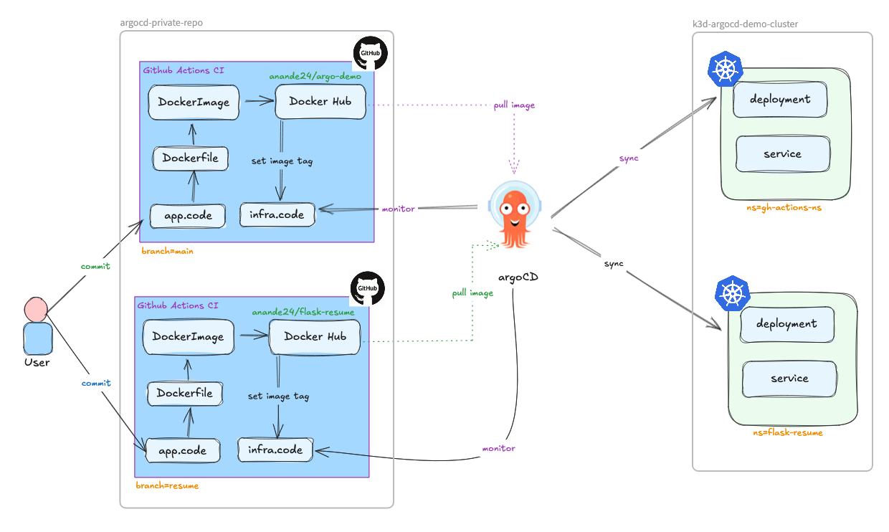
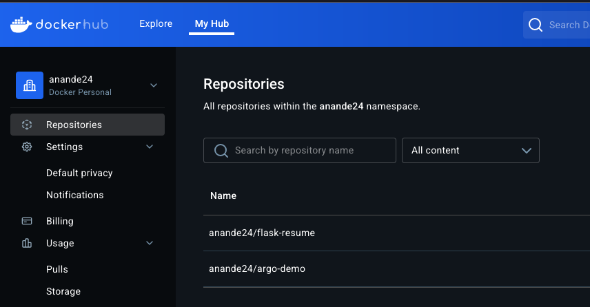

#### Instructions to setup ArgoCD locally on laptop

```
(For MacOS)
brew install kubectl

brew install k3d

k3d version

k3d cluster create argocd-cluster --config cluster-config.yaml
INFO[0000] Using config file cluster-config.yaml (k3d.io/v1alpha2#simple) 
WARN[0000] Default config apiVersion is 'k3d.io/v1alpha5', but you're using 'k3d.io/v1alpha2': consider migrating. 
INFO[0000] Prep: Network                                
INFO[0000] Created network 'k3d-argocd-cluster'         
INFO[0000] Created image volume k3d-argocd-cluster-images 
INFO[0000] Starting new tools node...                   
INFO[0000] Starting node 'k3d-argocd-cluster-tools'     
INFO[0001] Creating node 'k3d-argocd-cluster-server-0'  
INFO[0001] Creating node 'k3d-argocd-cluster-agent-0'   
INFO[0002] Creating node 'k3d-argocd-cluster-agent-1'   
INFO[0002] Creating LoadBalancer 'k3d-argocd-cluster-serverlb' 
INFO[0002] Using the k3d-tools node to gather environment information 
INFO[0003] Starting new tools node...                   
INFO[0003] Starting node 'k3d-argocd-cluster-tools'     
INFO[0004] Starting cluster 'argocd-cluster'            
INFO[0004] Starting servers...                          
INFO[0005] Starting node 'k3d-argocd-cluster-server-0'  
INFO[0012] Starting agents...                           
INFO[0012] Starting node 'k3d-argocd-cluster-agent-1'   
INFO[0013] Starting node 'k3d-argocd-cluster-agent-0'   
INFO[0018] Starting helpers...                          
INFO[0018] Starting node 'k3d-argocd-cluster-serverlb'  
INFO[0025] Injecting records for hostAliases (incl. host.k3d.internal) and for 5 network members into CoreDNS configmap... 
INFO[0027] Cluster 'argocd-cluster' created successfully! 
INFO[0027] You can now use it like this:                
kubectl cluster-info

kubectl cluster-info
Kubernetes control plane is running at https://0.0.0.0:58171
CoreDNS is running at https://0.0.0.0:58171/api/v1/namespaces/kube-system/services/kube-dns:dns/proxy
Metrics-server is running at https://0.0.0.0:58171/api/v1/namespaces/kube-system/services/https:metrics-server:https/proxy

To further debug and diagnose cluster problems, use 'kubectl cluster-info dump'.

kubectl get no 
NAME                          STATUS   ROLES                  AGE   VERSION
k3d-argocd-cluster-agent-0    Ready    <none>                 39s   v1.30.4+k3s1
k3d-argocd-cluster-agent-1    Ready    <none>                 39s   v1.30.4+k3s1
k3d-argocd-cluster-server-0   Ready    control-plane,master   45s   v1.30.4+k3s1

k create ns argocd
k get ns
```

#### For kubernetes manifest based ARGO install 
```
k apply -n argocd -f https://raw.githubusercontent.com/argoproj/argo-cd/refs/heads/master/manifests/install.yaml

k get deploy -n argocd
NAME                               READY   UP-TO-DATE   AVAILABLE   AGE
argocd-applicationset-controller   1/1     1            1           100s
argocd-dex-server                  1/1     1            1           100s
argocd-notifications-controller    1/1     1            1           100s
argocd-redis                       1/1     1            1           99s
argocd-repo-server                 1/1     1            1           99s
argocd-server                      1/1     1            1           99s

 k get svc -n argocd
NAME                                      TYPE        CLUSTER-IP      EXTERNAL-IP   PORT(S)                      AGE
argocd-applicationset-controller          ClusterIP   10.43.6.115     <none>        7000/TCP,8080/TCP            2m46s
argocd-dex-server                         ClusterIP   10.43.63.102    <none>        5556/TCP,5557/TCP,5558/TCP   2m46s
argocd-metrics                            ClusterIP   10.43.68.134    <none>        8082/TCP                     2m46s
argocd-notifications-controller-metrics   ClusterIP   10.43.154.59    <none>        9001/TCP                     2m46s
argocd-redis                              ClusterIP   10.43.214.146   <none>        6379/TCP                     2m46s
argocd-repo-server                        ClusterIP   10.43.140.28    <none>        8081/TCP,8084/TCP            2m46s
argocd-server                             ClusterIP   10.43.146.207   <none>        80/TCP,443/TCP               2m46s
argocd-server-metrics                     ClusterIP   10.43.157.173   <none>        8083/TCP                     2m46s

k get statefulset -n argocd
```

#### For HELM based ARGO install  

```
$ helm repo add argo https://argoproj.github.io/argo-helm
"argo" has been added to your repositories

$ helm repo update

$ helm search repo argocd

$ helm pull --untar argo/argo-cd

```
- Create argo domain certificates :  
```
$ mkcert argocd.local.com "*.local.com"

Created a new certificate valid for the following names 📜
 - "argocd.local.com"
 - "*.local.com"

Reminder: X.509 wildcards only go one level deep, so this won't match a.b.local.com ℹ️

The certificate is at "./argocd.local.com+1.pem" and the key at "./argocd.local.com+1-key.pem" ✅

It will expire on 28 April 2027 🗓
```
- Create the argocd tls secret that stores these certs :  
```
$ kubens argocd
Context "k3d-ingress-test" modified.
Active namespace is "argocd".

$ k create secret tls argocd-server-tls --key argocd.local.com+1-key.pem --cert argocd.local.com+1.pem
secret/argocd-server-tls created

$ helm install argocd . -f values.yaml
NAME: argocd
LAST DEPLOYED: Tue Jan 28 22:15:31 2025
NAMESPACE: argocd
STATUS: deployed
REVISION: 1
TEST SUITE: None
NOTES:
In order to access the server UI you have the following options:

1. kubectl port-forward service/argocd-server -n argocd 8080:443

    and then open the browser on http://localhost:8080 and accept the certificate

2. enable ingress in the values file `server.ingress.enabled` and either
      - Add the annotation for ssl passthrough: https://argo-cd.readthedocs.io/en/stable/operator-manual/ingress/#option-1-ssl-passthrough
      - Set the `configs.params."server.insecure"` in the values file and terminate SSL at your ingress: https://argo-cd.readthedocs.io/en/stable/operator-manual/ingress/#option-2-multiple-ingress-objects-and-hosts


After reaching the UI the first time you can login with username: admin and the random password generated during the installation. You can find the password by running:

kubectl -n argocd get secret argocd-initial-admin-secret -o jsonpath="{.data.password}" | base64 -d

(You should delete the initial secret afterwards as suggested by the Getting Started Guide: https://argo-cd.readthedocs.io/en/stable/getting_started/#4-login-using-the-cli)
```
- Edit your laptops `/etc/hosts` file to add the ingress external-IP and hostname:
```
$ k get ingress
NAME            CLASS     HOSTS              ADDRESS      PORTS     AGE
argocd-server   traefik   argocd.local.com   172.18.0.3   80, 443   12m

$ sudo echo "172.18.0.3 argocd.local.com" >> /etc/hosts
```
- Get the WEB-UI password from the secret :
`k get secret argocd-initial-admin-secret -o jsonpath="{.data.password}" | base64 -d && echo`
- Login to the webUI using :
```
u: admin
p: <as above>
```

#### For managing ARGO locally  
```
brew install argocd

argocd version
argocd: v2.13.3+a25c8a0
  BuildDate: 2025-01-03T20:00:35Z
  GitCommit: a25c8a0eef7830be0c2c9074c92dbea8ff23a962
  GitTreeState: clean
  GoVersion: go1.23.4
  Compiler: gc
  Platform: darwin/amd64
FATA[0000] Argo CD server address unspecified   

argocd version --client
argocd: v2.13.3+a25c8a0
  BuildDate: 2025-01-03T20:00:35Z
  GitCommit: a25c8a0eef7830be0c2c9074c92dbea8ff23a962
  GitTreeState: clean
  GoVersion: go1.23.4
  Compiler: gc
  Platform: darwin/amd64

k get all -n argocd  
```
#### Expose argocd-server service as NodePort

`k patch svc argocd-server -n argocd -p '{"spec": {"type": "NodePort"}}'`

#### Arogcd-apiserver access using port-forwarding

```
kubectl port-forward svc/argocd-server -n argocd 8080:443

Forwarding from 127.0.0.1:8080 -> 8080
Forwarding from [::1]:8080 -> 8080
Handling connection for 8080
```
This will allow you to access the ArgoCD dashboard using :
http://localhost:8080

The username|password can be fetched using :

```
k -n argocd get secret argocd-initial-admin-secret -o jsonpath="{.data.password}" | base64 -d && echo
JXDiZZSVJ5YszJjO
```
### Changing the argocd admin password
```
$ argocd login localhost:8080
WARNING: server certificate had error: tls: failed to verify certificate: x509: certificate signed by unknown authority. Proceed insecurely (y/n)? y
Username: admin
Password: 
'admin:login' logged in successfully
Context 'localhost:8080' updated

$ argocd account update-password
*** Enter password of currently logged in user (admin): 
*** Enter new password for user admin: 
*** Confirm new password for user admin: 
Password updated
Context 'localhost:8080' updated
```

#### NOTE:
`If you are adding a gitea instance running inside another k3d cluster, but running on the same underlying baremetal node(laptop), you can add the repo using the link like: http://k3d-gitea-cluster-server-0:31002/gitea_admin/testing.git`

### From CLI:

#### Adding Public repo
```
## repoURL should be created like:
## <service_name>.<service_namespace>.svc.cluster.local:<gitea_port>

# argocd repo add http://gitea-http.gitea.svc.cluster.local:3000/gitea_admin/testing.git --type git --name git_act_runner
Repository 'http://gitea-http.gitea.svc.cluster.local:3000/gitea_admin/testing.git' added
```


#### Adding Private repo



Also every branch's CI (github actions) will push the generated Docker image to their respective docker registries on [hub.docker.com](hub.docker.com). For this session I have created 2 registries:

- `anande24/flask-resume` : to consume docker image from `resume` branch.
- `anande24/argo-demo` : to consume docker image from `main` branch.



- Generate a Personal Access Token (PAT) in GitHub:

  - Go to GitHub Settings → Developer Settings → Personal Access Tokens

  - Generate a new token with repo access (read-only is enough)

  - Copy the token

- Add repo via CLI using username/PAT-token
```
# argocd repo add https://github.com/<username>/<repo>.git \
#  --username <your-github-username> \
#  --password <your-github-token>

$ argocd repo add https://github.com/anande/argo-private-stuff.git --type git --name argocd_private --username anande --password <pat_token>
Repository 'https://github.com/anande/argo-private-stuff.git' added
```
- Verify repo is added 
```
argocd repo list
TYPE  NAME            REPO                                              INSECURE  OCI    LFS    CREDS  STATUS      MESSAGE  PROJECT
git   argocd_private  https://github.com/anande/argo-private-stuff.git  false     false  false  true   Successful           
git   argocd_demo     https://github.com/anande/argocd-demo.git         false     false  false  false  Successful           default
```

## Create an Argo App from CLI:

This will by default select the HEAD/main branch
```
k create gh-actions-ns

argocd app create flask-app \
  --repo https://github.com/anande/argo-private-stuff.git \
  --path infra_code \
  --dest-server https://kubernetes.default.svc \
  --dest-namespace gh-actions-ns \
  --project default \
  --sync-policy automated

application 'flask-app' created
```

To select a specific non-main branch in its own other namespace:
```
k create ns flask-resume

argocd app create flask-resume \
  --repo https://github.com/anande/argo-private-stuff.git \
  --path hello_app \
  --revision resume \
  --dest-server https://kubernetes.default.svc \
  --dest-namespace flask-resume \
  --project default \
  --sync-policy automated

application 'flask-resume' created
```

#### Verify App has been created:
```
argocd app list
NAME              CLUSTER                         NAMESPACE      PROJECT  STATUS  HEALTH   SYNCPOLICY  CONDITIONS  REPO                                              PATH              TARGET
argocd/flask-app  https://kubernetes.default.svc  gh-actions-ns  default  Synced  Healthy  Auto        <none>      https://github.com/anande/argo-private-stuff.git  hello_app         
argocd/nginx      https://kubernetes.default.svc  default        default  Synced  Healthy  Auto-Prune  <none>      https://github.com/anande/argocd-demo.git         nginx_yaml_files  HEAD
```

##### DISCLAIMER (Knowledge Correction - This is not an issue):
As of this date, there's an issue with the ingressClass "traefik"  
when 2 services are running in different namespaces, but same k3d cluster.
Traefik creates 2 individual ingress resources per namespaces to access  
these services on their respective hostnames, however, assigns them the  
same external-IP.  
```
k -n gitea get ingress; k -n argocd get ingress
NAME    CLASS     HOSTS             ADDRESS      PORTS     AGE
gitea   traefik   gitea.local.com   172.18.0.3   80, 443   137m
NAME            CLASS     HOSTS              ADDRESS      PORTS     AGE
argocd-server   traefik   argocd.local.com   172.18.0.3   80, 443   18m
```
To overcome this, Metal-LB can be used [as mentioned here](https://github.com/anande/GitOps/wiki/Use-Metal-LB-to-assign-different-externalIP's-to-services-in-same-k3d-cluster).

## Upgrading ARGO-CD
Check the current version of argocd in `Chart.yaml`:
```
appVersion: v2.13.3
```
If you want to upgrade to the latest version, compare this to the upstream version available at :
1. [Community maintained helm chart](https://github.com/argoproj/argo-helm/blob/main/charts/argo-cd/Chart.yaml)
2. [ARGO Official Docs](https://argo-cd.readthedocs.io/en/stable/operator-manual/installation/#tested-versions)

Once you find any newer version compared to current, you can :
```
helm repo update
```
## Make sure you are in the helm charts dir:

Change the appVersion in Chart.yaml to the version you want to upgrade to.
```
helm upgrade argocd . -f values.yaml -n argocd
```

## Using Ingress with Traefik as default k3d IngressClass:

For SSL Passthrough, which expects certificate to be present (using mkcert), Traefik does not work with ingress annotations like nginx-ingress In order to make it work, it requires special [IngressTCPRoute](../argo/argo-cd/TraefikIngressRouteTCP.yaml) to be defined.

```
kubectl apply -f TraefikIngressRouteTCP.yaml -n argocd
```

## Monitor ARGO-CD via Prometheus:

#### Prometheus Config
```
server:
  ...
  metrics:
  enabled: true
  service:
    servicePort: 8082

  serviceMonitor:
    # -- Enable a prometheus ServiceMonitor
    enabled: true
```

#### ArgoCD Config
```
    additionalScrapeConfigs:
    - job_name: argocd
      metrics_path: "/metrics"
      static_configs:
        - targets: 
            - "argocd-server-metrics.argocd.svc.cluster.local:8082"  ## Check which exact metrics service exposes 8082 for ARGOCD  
```

#### Upgrade Helm charts for both argo and prometheus:
```
helm upgrade prometheus . -f values.yaml -n prometheus
helm upgrade argocd . -n argocd -f values.yaml
```

## Create and connect to a GKE cluster:

```
brew install --cask google-cloud-sdk

gcloud init

gcloud container clusters create dev --num-nodes=2 --zone=us-central1-a

gcloud components install gke-gcloud-auth-plugin

gcloud container clusters get-credentials dev --zone=us-central1-a

kubectl config get-contexts

argocd login localhost:9999      # Note: 9999 is the port-forwarded port on localhost

argocd cluster add gke_dumptest-452406_us-central1-a_dev

WARNING: This will create a service account `argocd-manager` on the cluster referenced by context `gke_dumptest-452406_us-central1-a_dev` with full cluster level privileges. Do you want to continue [y/N]? y
INFO[0010] ServiceAccount "argocd-manager" created in namespace "kube-system" 
INFO[0010] ClusterRole "argocd-manager-role" created    
INFO[0011] ClusterRoleBinding "argocd-manager-role-binding" created 
INFO[0012] Created bearer token secret for ServiceAccount "argocd-manager" 
Cluster 'https://104.154.21.82' added


argocd cluster list
SERVER                          NAME                                   VERSION  STATUS      MESSAGE                                                  PROJECT
https://104.154.21.82           gke_dumptest-452406_us-central1-a_dev           Unknown     Cluster has no applications and is not being monitored.  
https://kubernetes.default.svc  in-cluster                             1.30     Successful


argocd app create simple \
  --repo https://github.com/anande/argocd-demo.git \
  --path nginx_yaml_files \
  --dest-server https://104.154.21.82 \
  --dest-namespace simple \
  --project default \
  --sync-policy automated
```