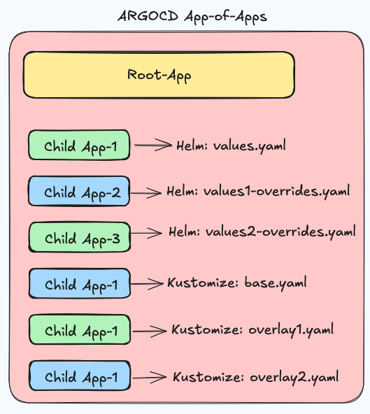

ArgoCD UI > Create New APP > Edit as YAML > Create APP

Gitea repo created as:
https://gitea.local.com/gitea_admin/keycloak.git

Create Root App :
```
argocd app create root-app \
--project default \
--repo https://github.com/anande/GitOps.git \
--path "./app-of-apps/apps" \
--dest-namespace argocd \
--dest-server https://kubernetes.default.svc
```
