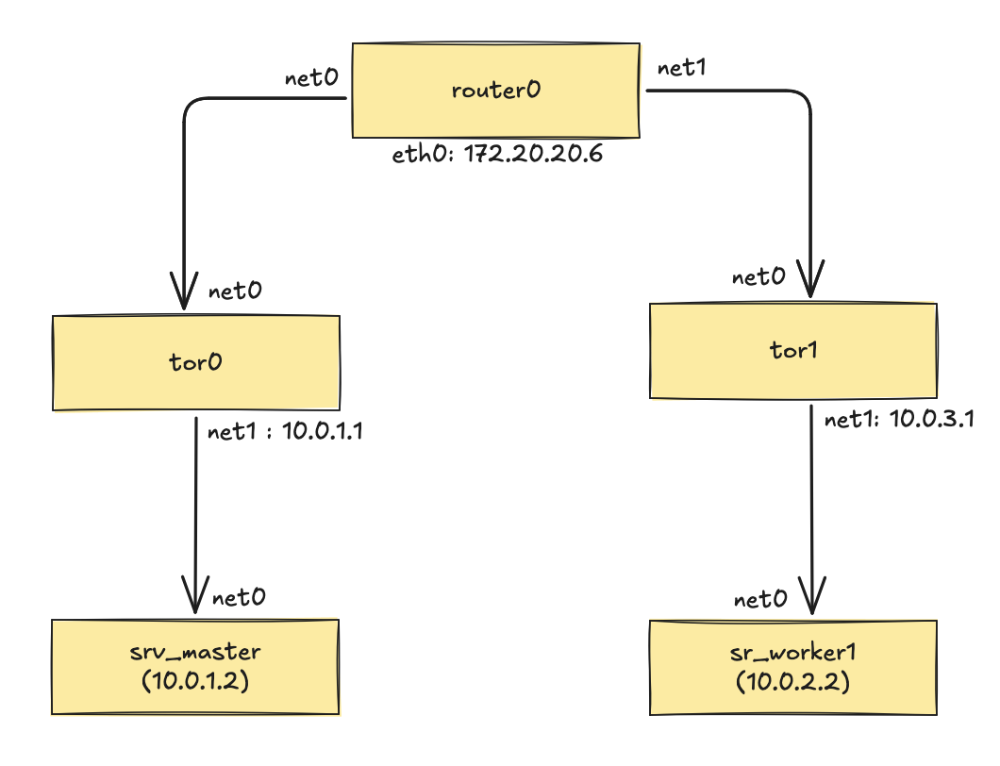

# K3d Cluster with 1-Master, 1 Worker nodes
```
k3d cluster create clab \
--config k3d-cluster-clab-1M_1W.yaml \
--k3s-arg '--disable=servicelb@server:0' \
--network clab
```

- [Containerlab BGP topo 1_Master, 3_Worker](https://gist.github.com/anande/2e2c15215b904a116ff03521d1fb3213)  
- [Containerlab BGP topo 1_Master, 1_Worker](https://gist.github.com/anande/637cf8a1747b64c632b8c9001bfdbaa5)

## In 1 Master:1 Worker Topology:



```
docker exec -ti clab-bgp-topo-router0 vtysh -c "show bgp summary wide"

IPv4 Unicast Summary (VRF default):
BGP router identifier 10.0.0.0, local AS number 65000 vrf-id 0
BGP table version 6
RIB entries 11, using 2024 bytes of memory
Peers 2, using 1433 KiB of memory
Peer groups 1, using 64 bytes of memory

Neighbor        V         AS    LocalAS   MsgRcvd   MsgSent   TblVer  InQ OutQ  Up/Down State/PfxRcd   PfxSnt Desc
tor0(net0)      4      65010      65000        92        93        0    0    0 00:04:15            2        7 N/A
tor1(net1)      4      65011      65000        92        93        0    0    0 00:04:15            2        7 N/A

Total number of neighbors 2

docker exec -ti clab-bgp-topo-tor0 vtysh -c "show bgp summary wide"

IPv4 Unicast Summary (VRF default):
BGP router identifier 10.0.0.1, local AS number 65010 vrf-id 0
BGP table version 7
RIB entries 11, using 2024 bytes of memory
Peers 2, using 1433 KiB of memory
Peer groups 2, using 128 bytes of memory

Neighbor        V         AS    LocalAS   MsgRcvd   MsgSent   TblVer  InQ OutQ  Up/Down State/PfxRcd   PfxSnt Desc
router0(net0)   4      65000      65010        98        98        0    0    0 00:04:33            5        7 N/A
10.0.1.2        4          0      65010         0         0        0    0    0    never       Active        0 N/A

Total number of neighbors 2

docker exec -ti clab-bgp-topo-tor1 vtysh -c "show bgp summary wide"

IPv4 Unicast Summary (VRF default):
BGP router identifier 10.0.0.2, local AS number 65011 vrf-id 0
BGP table version 7
RIB entries 11, using 2024 bytes of memory
Peers 2, using 1433 KiB of memory
Peer groups 2, using 128 bytes of memory

Neighbor        V         AS    LocalAS   MsgRcvd   MsgSent   TblVer  InQ OutQ  Up/Down State/PfxRcd   PfxSnt Desc
router0(net0)   4      65000      65011       101       101        0    0    0 00:04:41            5        7 N/A
10.0.2.2        4          0      65011         0         0        0    0    0    never       Active        0 N/A

Total number of neighbors 2
```

Install Metal-LB:
```
helm install metallb . --values values.yaml -n metallb-system --create-namespace
```

Apply BGP Manifests:
```
k apply -f bgp-bfdprofile.yaml ;\
k apply -f bgp-peer.yaml ;\
k apply -f bgp-pool.yaml ;\
k apply -f bgp-adv.yaml ;\
kubectl apply -f https://raw.githubusercontent.com/metallb/frr-k8s/main/config/all-in-one/frr-k8s.yaml ;\
sleep 60 ;\
k apply -f bgp-frr-config.yaml
```