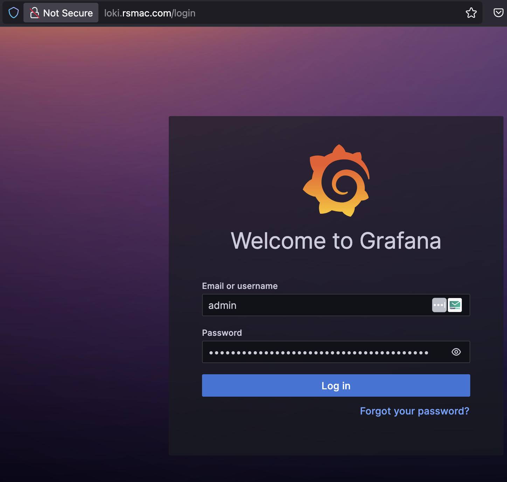
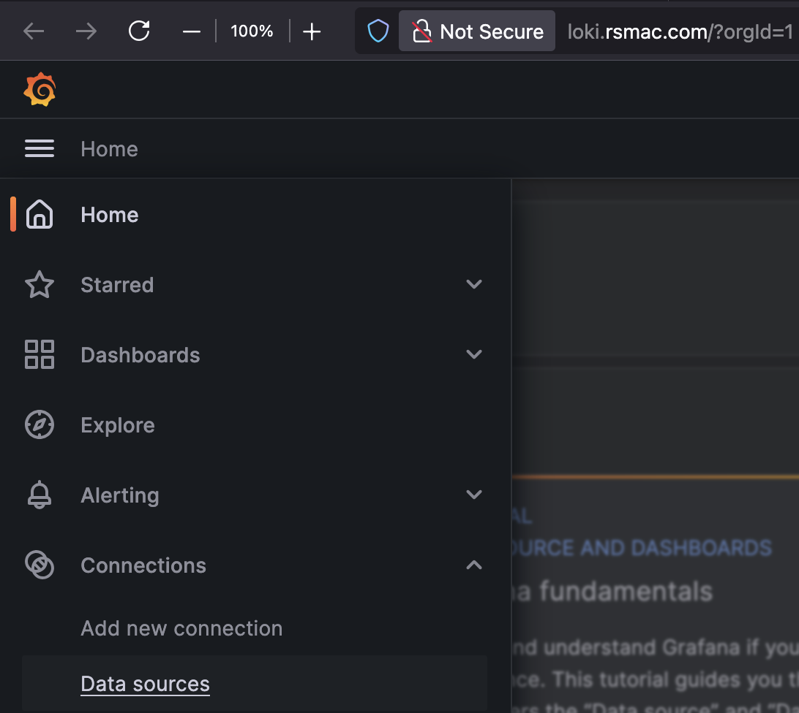
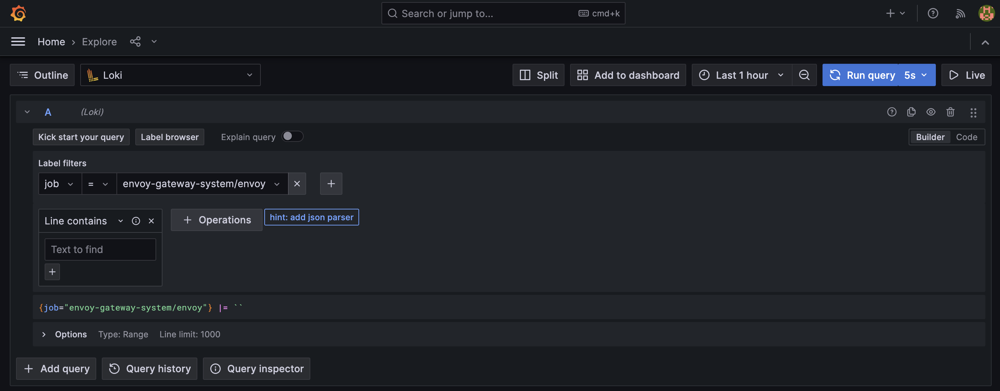
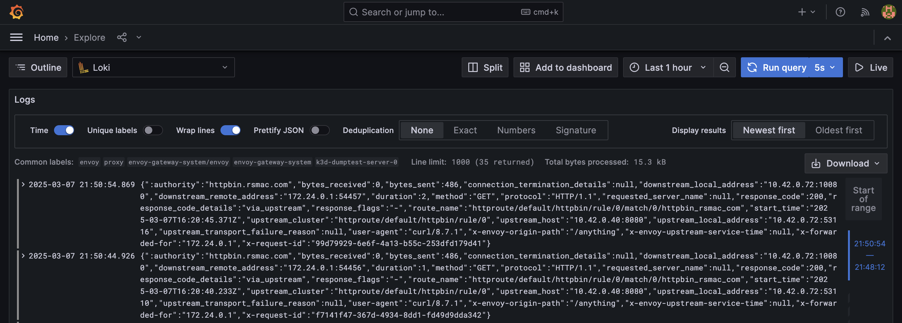
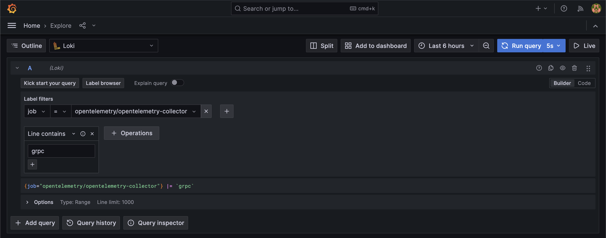
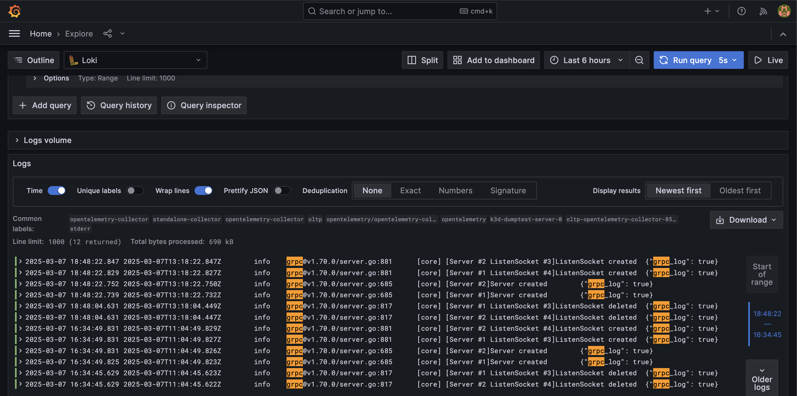

#### Cluster Setup

Configure your k3d cluster at startup like below:

```
k3d cluster create dumptest \
--k3s-arg '--disable=servicelb@server:0' \
--k3s-arg '--disable=metrics-server@server:0' \
--k3s-arg '--disable=traefik@server:0'
```

#### Install envoy-gw using helm chart :
```
helm install eg oci://docker.io/envoyproxy/gateway-helm --version v0.0.0-latest -n envoy-gateway-system --create-namespace
```

Make sure gatewayAPI CRD's are installed and configured :
```
kubectl apply -f https://github.com/kubernetes-sigs/gateway-api/releases/download/v1.2.1/standard-install.yaml

k apply -f envoy-gw-class.yaml

k apply -f envoy-gw.yaml

k apply -f envoy-http-route.yaml

k apply -f envoyproxy-file-sink.yaml
```

By default Envoy-Gateway relies on the Clusters LoadBalancerController to assign it an ExternalIP since its a LoadBalancer type service running in its own namespace. The LoadBalancer can be anything (MetalLB/Traefik etc.) There's no need for ingressController presence in the cluster.

K3d ships with Klipper as the LoadbalancerController which controls the serviceLB and Traefik as the ingressController. You can disable these both while working with MetalLB + K3D.


Install test App - `httpbin` :
```
kubectl apply -f https://raw.githubusercontent.com/istio/istio/master/samples/httpbin/httpbin.yaml
```

Check the externalIP/Address in the following output and update `/etc/hosts` with the relavant `IP-addr:hostname` combo.

`k get gateway`

Now try accessing the hostname in the browser.

#### NOTE: Make sure that the hostname/IP are the same in the HTTPRoute definition and the /etc/hosts file.

## Client IP Logging 

To enable **client IP logging** using the `X-Forwarded-For` header in **Envoy Gateway** via Helm, follow these steps:

### **Step 1: Configure Access Logs for `X-Forwarded-For`**

Envoy Gateway supports access logging customization, which allows you to log the `X-Forwarded-For` header (client IP). Update the `EnvoyProxy` resource to include the desired log format.

1. Create or update an `EnvoyProxy` YAML configuration file [envoyproxy-client-ip.yaml](eg_resources/eg-proxy-otlp-sink.yaml) to enable access logging with `X-Forwarded-For`. This configuration ensures that the `X-Forwarded-For` header is included in the access logs.

2. Apply the configuration:
   ```bash
   kubectl apply -f envoyproxy-client-ip.yaml
   ```

---

### **Step 2: Verify Access Logs**

Once the configuration is applied, you can verify the logs to ensure that client IPs are being logged correctly.

1. Using curl to httpbin app:
```
curl http://httpbin.rsmac.com/dump/request
GET /dump/request HTTP/1.1
Host: httpbin.rsmac.com
Accept: */*
User-Agent: curl/8.7.1
X-Forwarded-For: 172.24.0.1
X-Forwarded-Proto: http
X-Request-Id: fb5761fe-a07f-416f-b892-46e38faf783c


curl http://httpbin.rsmac.com/anything | jq .headers | grep -A1 "X-Forwarded-For"
  % Total    % Received % Xferd  Average Speed   Time    Time     Time  Current
                                 Dload  Upload   Total   Spent    Left  Speed
100   486  100   486    0     0  55772      0 --:--:-- --:--:-- --:--:-- 60750
  "X-Forwarded-For": [
    "172.24.0.1"
```


If you're not using OpenTelemetry, you can configure a different sink e.g. [file-based logging](eg_resources/eg-proxy-file-sink.yaml) and check logs directly.

2. From loki GUI: 

Get the username/password from the stored secret  

username: `k get secrets loki-grafana -n loki -o jsonpath="{.data.admin-user}" | base64 -d`  

password: `k get secrets loki-grafana -n loki -o jsonpath="{.data.admin-password}" | base64 -d`  

Login to the Grafana-UI, If you have the `loki-grafana` service as `type: LoadBalancer`, you should get an `EXTERNAL-IP` (from the metalLB ip-addr-pool) which you can create an A-record in the `/etc/hosts` file.



Use the credentials obtained from the secrets.  

Once logged in, select Loki as the Datasource:



#### Explore Loki Datasource:  
- Query: Select `job > envoy-gateway-system/envoy` and observe the logs search result (Make sure you have ran Step 2.1 above using curl commands to interact with the app):





- Query: Select `job > opentelemetry/openetelemetry-collector`





#### NOTE: 
1. Make sure that gRPC server started logs are seen in there.  
2. Make sure that there are no loki or exporter related errors seen in these logs.

### **Optional Step (not absolutely required): Enable Trusted Hops for Accurate Client IPs**

If your Envoy Gateway is behind another proxy (e.g., a load balancer), you need to configure trusted hops to ensure accurate client IP logging from the `X-Forwarded-For` header.

1. Add the `xff_num_trusted_hops` parameter in your Helm values or directly in the configuration:

```yaml
apiVersion: gateway.envoyproxy.io/v1alpha1
kind: EnvoyProxy
metadata:
  name: client-ip-trusted-hops
  namespace: envoy-gateway-system
spec:
  telemetry:
    accessLog:
      settings:
        ...
    proxyConfig:
      xff_num_trusted_hops: 2 # Adjust based on your proxy setup.
```

2. Apply this configuration as before.

### Summary

By enabling access logging and including `%REQ(X-FORWARDED-FOR)%` in the log format, you can effectively log client IP addresses in Envoy Gateway. Use trusted hops (`xff_num_trusted_hops`) if your setup involves intermediate proxies or load balancers. Validate logs using tools like Loki or other observability platforms.

#### Citations:  
[1] https://tetrate.io/blog/proxy-observability-scenarios-with-envoy-gateway/  
[2] https://gateway.envoyproxy.io/docs/tasks/observability/proxy-accesslog/  
[3] https://layer5.io/blog/service-mesh/debug-envoy-proxy  
[4] https://gateway.envoyproxy.io/latest/install/install-helm/  
[5] https://docs.solo.io/gloo-gateway/2.4.x/observability/dataplane/ingress-gateway/access-logs/  
[6] https://github.com/envoyproxy/gateway/releases  
[7] https://newreleases.io/project/artifacthub/helm/envoy-gateway/gateway-helm/release/1.2.0  
[8] https://stackoverflow.com/questions/tagged/envoyproxy  

---  

Answer from Perplexity: https://www.perplexity.ai/search/docker-desktop-kubernetes-fail-0T1nZkpiRu6jtmvwTZ0tyQ?utm_source=copy_output  

---
#### References:  
- [Opentelemetry Enablement](../observability/opentelemetry/README.md)  
- [Loki Enablement](../observability/loki-stack/README.md)  