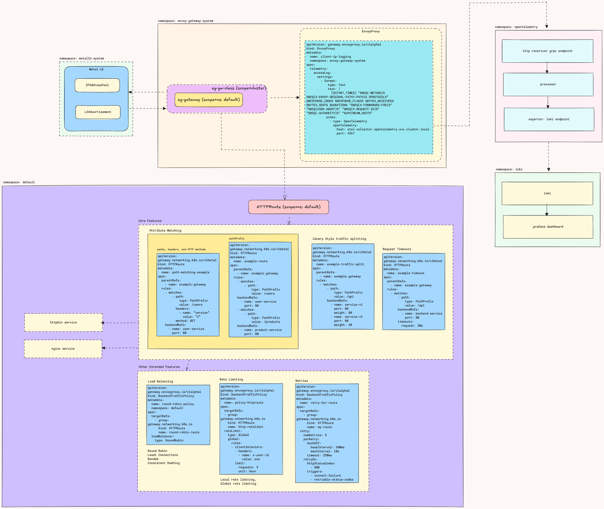

#### Cluster Setup

Configure your k3d cluster at startup like below:

```
k3d cluster create dumptest \
--k3s-arg '--disable=servicelb@server:0' \
--k3s-arg '--disable=metrics-server@server:0' \
--k3s-arg '--disable=traefik@server:0'
```

#### Install envoy-gw using helm chart :
```
helm install eg oci://docker.io/envoyproxy/gateway-helm --version v0.0.0-latest -n envoy-gateway-system --create-namespace
```

Make sure gatewayAPI CRD's are installed and configured :
```
kubectl apply -f https://github.com/kubernetes-sigs/gateway-api/releases/download/v1.2.1/standard-install.yaml

k apply -f envoy-gw-class.yaml

k apply -f envoy-gw.yaml

k apply -f envoy-http-route.yaml
```

By default Envoy-Gateway relies on the Clusters LoadBalancerController to assign it an ExternalIP since its a LoadBalancer type service running in its own namespace. The LoadBalancer can be anything (MetalLB/Traefik etc.) There's no need for ingressController presence in the cluster.

K3d ships with Klipper as the LoadbalancerController which controls the serviceLB and Traefik as the ingressController. You can disable these both while working with MetalLB + K3D.



Install test App:
```
kubectl apply -f https://raw.githubusercontent.com/istio/istio/master/samples/httpbin/httpbin.yaml
```

Check the externalIP/Address in the following output and update /etc/hosts with the relavant hostname:IP combo.

`k get gateway`

Now try accessing the hostname in the browser.

#### NOTE: Make sure that the hostname/IP are the same in the HTTPRoute definition and the /etc/hosts file.