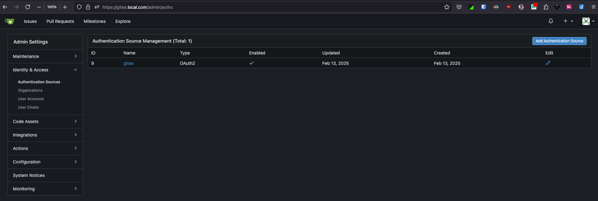
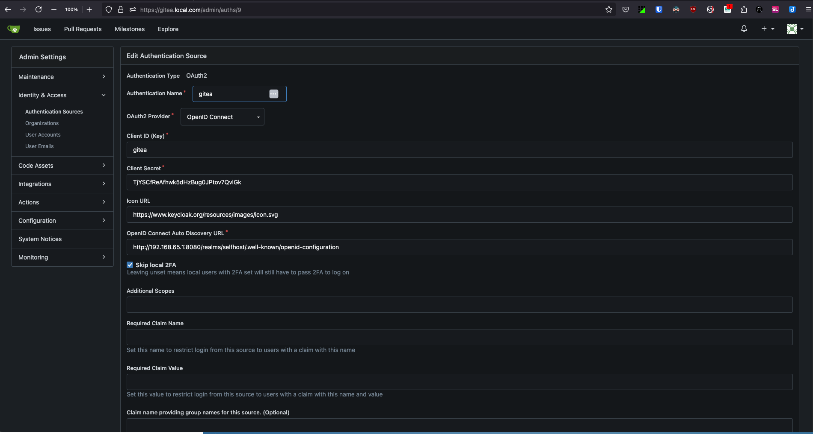
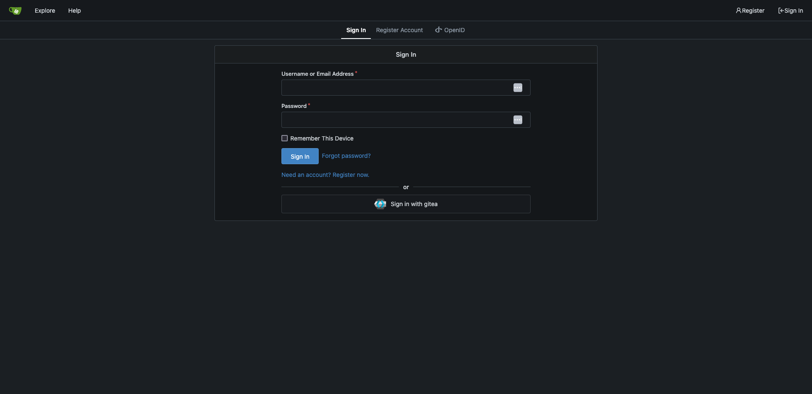

### Steps to deploy gitea locally

The following steps build a gitea environment which auto-enables gitea-actions (similar to github actions) alongwith act-runners (a.k.a git runnners) running as pods in the same k8s-cluster+namespace using the dynamically generated runner token to auto-register the runners to the git repos [1].

The more the number of runners, the faster the actions are processed. This though - comes at the compute resource cost to have the runner idle waiting on some actions to execute.

- Verify that you are logged into the k3s context
```
kubectl config get-contexts
CURRENT   NAME             CLUSTER          AUTHINFO              NAMESPACE
          argocd-cluster                                          
          docker-desktop   docker-desktop   docker-desktop        
*         k3d-gitea-new    k3d-gitea-new    admin@k3d-gitea-new  

(If not using the gitea-context - switch to it)

k config use-context k3d-gitea-new
Switched to context "k3d-gitea-new".
```

- Create local self-signed certs that you wish to use with gitea ingress:
```
$ mkcert gitea.local.com "*.local.com"

Created a new certificate valid for the following names 📜
 - "gitea.local.com"
 - "*.local.com"

Reminder: X.509 wildcards only go one level deep, so this won't match a.b.local.com ℹ️

The certificate is at "./gitea.local.com+1.pem" and the key at "./gitea.local.com+1-key.pem" ✅

It will expire on 26 April 2027 🗓
```

- Create a **gitea** namespace and use the cert+key to create the certificate secret (Make sure you are in the right working directory where the certs were generated in the above step):

```
$ k create ns gitea
namespace/gitea created

$ k -n gitea create secret tls gitea-ingress-tls-cert --key gitea.local.com+1-key.pem --cert gitea.local.com+1.pem 
secret/gitea-ingress-tls-cert created
```


- Install Gitea using helm chart  
`helm install gitea . -f values.yaml -n gitea --create-namespace`

- Use `k9s` to monitor resources in `gitea` namespace

- Make sure you update the `/etc/hosts` file with the address of the ingress.

- Login to the webUI using username/password from the helm values.yaml

#### Use Gitea Actions:

In order to use actions with hosted gitea runners, you need to manually have node.js installed inside the runner containers.  

You can do that by either logging into the container manaully (using k9s shell):
```
gitea-act-runner-0:/data# apk add --no-cache nodejs
fetch https://dl-cdn.alpinelinux.org/alpine/v3.20/main/x86_64/APKINDEX.tar.gz
fetch https://dl-cdn.alpinelinux.org/alpine/v3.20/community/x86_64/APKINDEX.tar.gz
(1/7) Installing libgcc (13.2.1_git20240309-r0)
(2/7) Installing libstdc++ (13.2.1_git20240309-r0)
(3/7) Installing ada-libs (2.7.8-r0)
(4/7) Installing libbase64 (0.5.2-r0)
(5/7) Installing icu-data-en (74.2-r0)
Executing icu-data-en-74.2-r0.post-install
*
* If you need ICU with non-English locales and legacy charset support, install
* package icu-data-full.
*
(6/7) Installing icu-libs (74.2-r0)
(7/7) Installing nodejs (20.15.1-r0)
Executing busybox-1.36.1-r29.trigger
OK: 74 MiB in 39 packages
gitea-act-runner-0:/data# which node
/usr/bin/node
gitea-act-runner-0:/data# node -v
v20.15.1
```
OR adding a task/step like below in the gitea `.workflow/<workflow_name>.yaml`:
```
      - name: install node
        run: apk add --no-cache nodejs
```
Then test the Actions using the example available [at this location](https://docs.gitea.com/usage/actions/quickstart#use-actions).


#### Using GPG key :

- [Install the GPG binary](https://sourceforge.net/projects/gpgosx/files/GnuPG-2.4.7.dmg/download?use_mirror=webwerks&use_mirror=webwerks&r=https%3A%2F%2Fsourceforge.net%2Fp%2Fgpgosx%2Fdocu%2FDownload%2F)
- Create a GPG key locally on laptop
```
$ gpg --list-secret-keys --keyid-format=long
gpg: directory '/Users/anand.nande/.gnupg' created
gpg: /Users/anand.nande/.gnupg/trustdb.gpg: trustdb created

$ gpg --full-generate-key

gpg (GnuPG) 2.4.7; Copyright (C) 2024 g10 Code GmbH
This is free software: you are free to change and redistribute it.
There is NO WARRANTY, to the extent permitted by law.

Please select what kind of key you want:
   (1) RSA and RSA
   (2) DSA and Elgamal
   (3) DSA (sign only)
   (4) RSA (sign only)
   (9) ECC (sign and encrypt) *default*
  (10) ECC (sign only)
  (14) Existing key from card
Your selection? 1
RSA keys may be between 1024 and 4096 bits long.
What keysize do you want? (3072) 
Requested keysize is 3072 bits
Please specify how long the key should be valid.
         0 = key does not expire
      <n>  = key expires in n days
      <n>w = key expires in n weeks
      <n>m = key expires in n months
      <n>y = key expires in n years
Key is valid for? (0) 
Key does not expire at all
Is this correct? (y/N) y

GnuPG needs to construct a user ID to identify your key.

Real name: anande
Email address: anande@example.com
Comment: First GPG Key
You selected this USER-ID:
    "anande (First GPG Key) <anande@example.com>"

Change (N)ame, (C)omment, (E)mail or (O)kay/(Q)uit? O
We need to generate a lot of random bytes. It is a good idea to perform
some other action (type on the keyboard, move the mouse, utilize the
disks) during the prime generation; this gives the random number
generator a better chance to gain enough entropy.
We need to generate a lot of random bytes. It is a good idea to perform
some other action (type on the keyboard, move the mouse, utilize the
disks) during the prime generation; this gives the random number
generator a better chance to gain enough entropy.
gpg: directory '/Users/anand.nande/.gnupg/openpgp-revocs.d' created
gpg: revocation certificate stored as '/Users/anand.nande/.gnupg/openpgp-revocs.d/C135C6F5CFCC21C2B2306CA553842E936F11B5BE.rev'
public and secret key created and signed.

pub   rsa3072 2025-01-26 [SC]
      C135C6F5CFCC21C2B2306CA553842E936F11B5BE
uid                      anande (First GPG Key) <anand.nande@rackspace.com>
sub   rsa3072 2025-01-26 [E]


$ gpg --list-secret-keys --keyid-format=long
gpg: checking the trustdb
gpg: marginals needed: 3  completes needed: 1  trust model: pgp
gpg: depth: 0  valid:   1  signed:   0  trust: 0-, 0q, 0n, 0m, 0f, 1u
[keyboxd]
---------
sec   rsa3072/53842E936F11B5BE 2025-01-26 [SC]
      C135C6F5CFCC21C2B2306CA553842E936F11B5BE
uid                 [ultimate] anande (First GPG Key) <anande@example.com>
ssb   rsa3072/B72BC540EC2ECD3E 2025-01-26 [E]
```

- Print the GPG Key ID :

```
% gpg --armor --export 53842E936F11B5BE
-----BEGIN PGP PUBLIC KEY BLOCK-----
.....
....
...
..
.
-----END PGP PUBLIC KEY BLOCK-----
```

- You can either [Add this key to your GH account](https://docs.github.com/en/authentication/managing-commit-signature-verification/adding-a-gpg-key-to-your-github-account) OR use this in the helm values.yaml to have it added during gitea installation

###### References:
1. https://gitea.com/gitea/helm-chart/pulls/666
2. [Fix for node package inside gitea runner container](https://forum.gitea.com/t/gitea-actions-cannot-find-node-in-path/7544/5)  

## Integrating Gitea with Keycloak as OIDC

#### Gitea configuration required

- Following settings need to be applied in `/data/gitea/conf/app.ini`. One can do this either by :  
  1. Accessing the gitea container and directly updating the config like below:
  ```
  [openid]
  ENABLE_OPENID_SIGNIN = true
  ENABLE_OPENID_SIGNUP = true
  ```
  2. OR in the helm `values.yaml` using below and then upgrading the helm chart:
  ```
  gitea:
   config:
   ...
     openid:
       ENABLE_OPENID_SIGNIN: true
       ENABLE_OPENID_SIGNUP: true
  ```

**Gitea Authentication Source (Web UI):** In Gitea, go to "Site Administration" and then "Authentication Sources". Add a new authentication source with these settings:  
    -   _Authentication Type_: `OAuth2`  
    -   _Authentication Name_: A descriptive name (e.g., `Keycloak`)  
    -   _OAuth2 Provider_: `OpenID Connect`  
    -   _Client ID_: The Client ID from Keycloak (e.g., `gitea`)  
    -   _Client Secret_: The Client Secret from Keycloak  
    -   _Icon URL: (Optional)_  [Official Keycloak Icon URL](https://www.keycloak.org/resources/images/icon.svg)  
    -   _OpenID Connect Auto Discovery URL:_ The Keycloak OpenID Connect discovery URL. This can be found in your Keycloak realm settings under "Endpoints". 

- **If using docker-manager-keycloak-container**: Get the Docker Host IP using  below. The URL format is typically: `http://YOUR_DOCKER_HOST_IP:PORT_NO/realms/YOUR_REALM/.well-known/openid-configuration`
```
ifconfig | grep "192."
	inet 192.168.1.21 netmask 0xffffff00 broadcast 192.168.1.255
	inet 192.168.65.1 netmask 0xffffff00 broadcast 192.168.65.255
```
- **If using k8s-managed-keycloak**: The format is typically: `https://YOUR_KEYCLOAK_INGRESS_URL/auth/realms/YOUR_REALM/.well-known/openid-configuration` (Use this EXACT URL format).  Replace `YOUR_KEYCLOAK_INGRESS_URL` and `YOUR_REALM` with your actual values.





###### References: 
1. [SSO with keycloak](https://www.talkingquickly.co.uk/gitea-sso-with-keycloak-openldap-openid-connect)