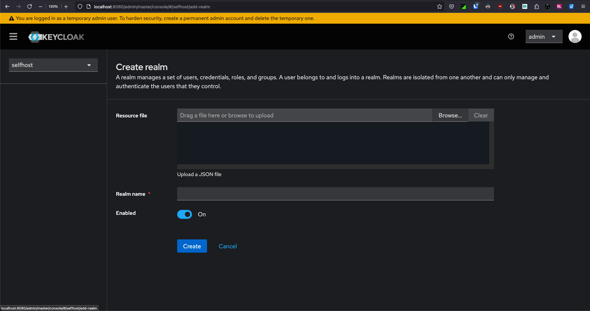
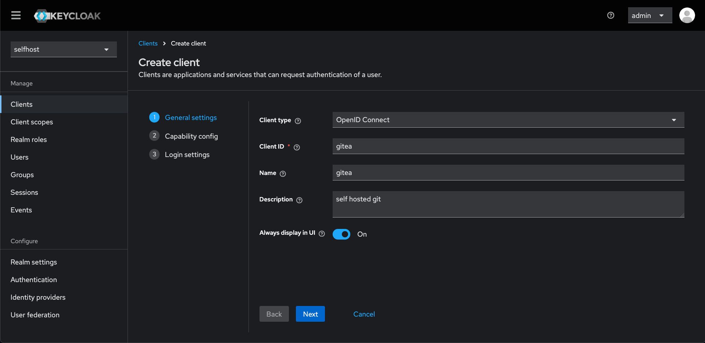
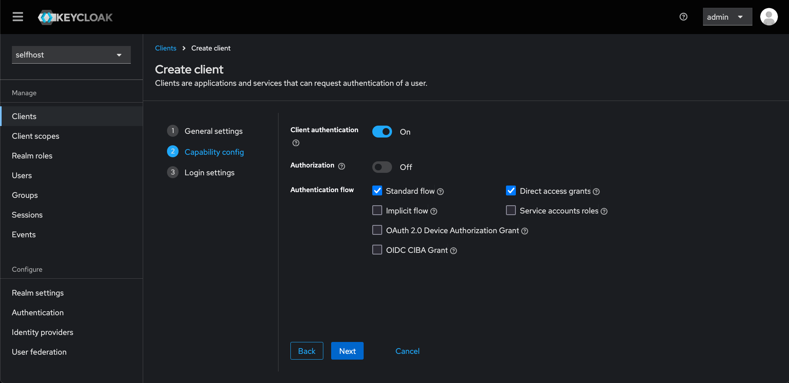
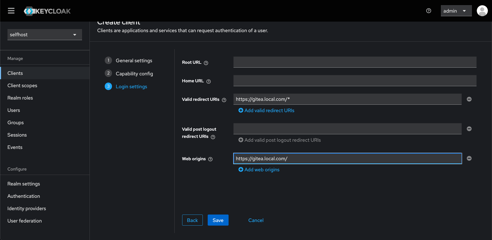
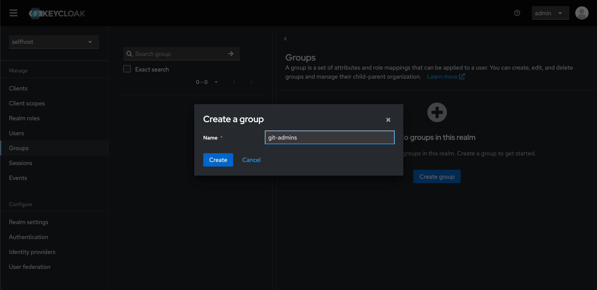
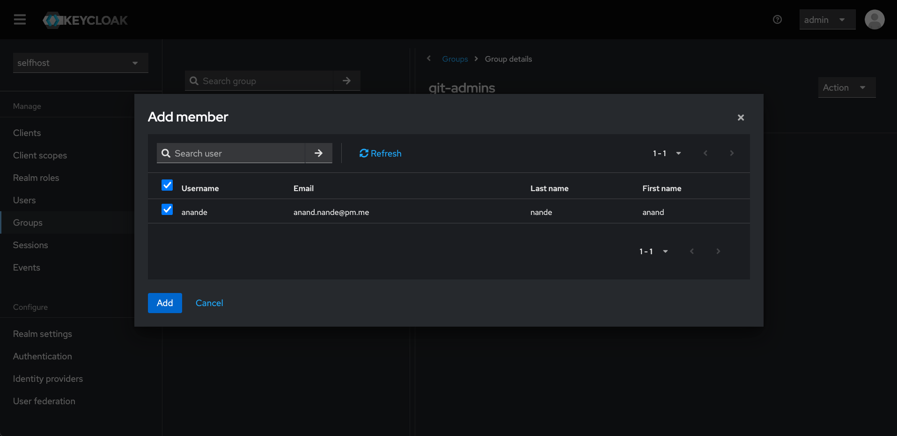
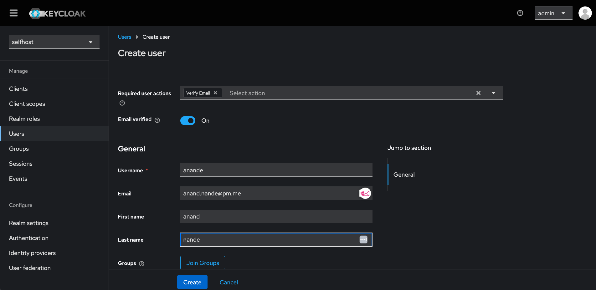
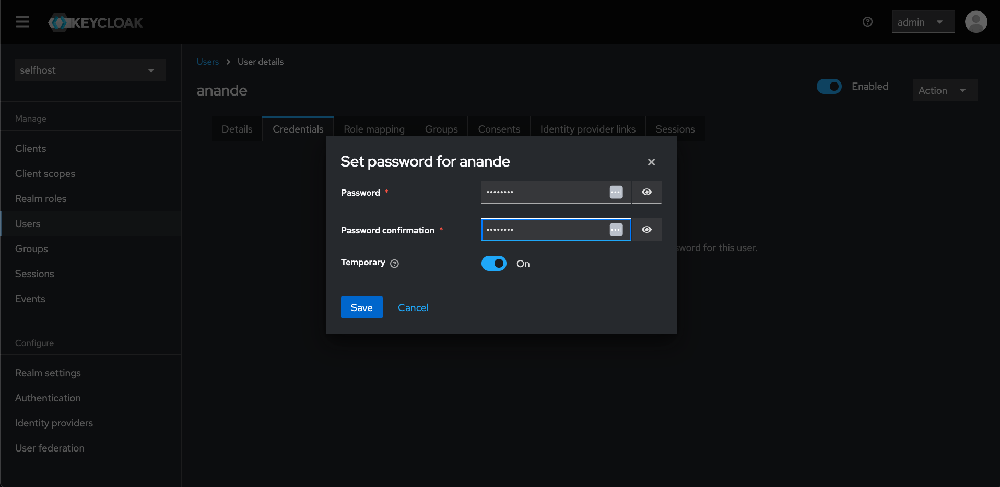
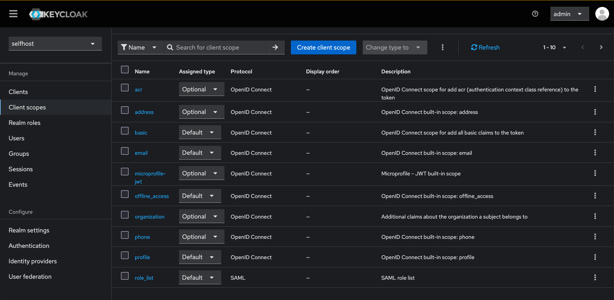

## Installation

Keycloak can be installed in various ways

1. [Directly run using docker command](#directly-run-using-docker-command)
2. Using Docker Compose
3. Using Kubernetes Manifests
4. Using Helm charts

### Directly run using docker command

Run docker container in detached mode
```
docker run -d -p 8080:8080 \
-e KC_BOOTSTRAP_ADMIN_USERNAME=admin \
-e KC_BOOTSTRAP_ADMIN_PASSWORD=admin \
quay.io/keycloak/keycloak:26.1.2 \
start-dev
```

The container needs additional configuration inside it.
Access the shell of the container (using `docker exec` or via Docker Desktop):
```
sh-5.1$ /opt/keycloak/bin/kc.sh start --http-port=8080 --hostname-strict=false
```
For the docker-managed to be able to connect to the pod-managed containers of gitea, Networking needs to be fixed. The docker-managed container needs to have an IP in the same network subnet as that of the gitea/client-application containers.

Check which docker bridges exist currently:
```
docker network ls
NETWORK ID     NAME                                                             DRIVER    SCOPE
09b74a760da4   gitea-argocd-network                                             bridge    local
17cc6b6d1621   host                                                             host      local
8f7acb08ab86   k3d-helm-kust-test                                               bridge    local
e92dfb88f9a8   k3d-ingress-test                                                 bridge    local
c3c265ca841f   portainer_portainer-docker-extension-desktop-extension_default   bridge    local
```
Usually the docker-network will be having the same name as k8s-cluster-context where the gitea app is running. 
```
docker network inspect k3d-ingress-test --format='{{json .}}'
{"Name":"k3d-ingress-test","Id":"e92dfb88f9a8245cbab51e61885f3fa4b94ec4a5ce72a21718c1756213b60fa3","Created":"2025-01-28T14:16:46.377452163Z","Scope":"local","Driver":"bridge","EnableIPv6":false,"IPAM":{"Driver":"default","Options":null,"Config":[{"Subnet":"172.18.0.0/16","Gateway":"172.18.0.1"}]},"Internal":false,"Attachable":false,"Ingress":false,"ConfigFrom":{"Network":""},"ConfigOnly":false,"Containers":{"728ee992dc28acb830c28c348ace2d24418e50892f494e53ae2779f1ba7b8933":{"Name":"k3d-ingress-test-serverlb","EndpointID":"2c26e74dafc49c712758734e8455c83148309509267c5a94c7145e0ab4891270","MacAddress":"02:42:ac:12:00:03","IPv4Address":"172.18.0.3/16","IPv6Address":""},"e7b290c2f476bee150779669468389345948f3994100050e3aa99bc2cfe63343":{"Name":"k3d-ingress-test-server-0","EndpointID":"18f8fd7c408665359c56f732f0f69def12e82a709d7c3fa5250f16439e2b8c0a","MacAddress":"02:42:ac:12:00:02","IPv4Address":"172.18.0.2/16","IPv6Address":""}},"Options":{"com.docker.network.bridge.enable_ip_masquerade":"true"},"Labels":{"app":"k3d"}}
```
Check the container ID:
```
docker ps 
CONTAINER ID   IMAGE                              COMMAND                  CREATED             STATUS             PORTS                                        NAMES
66aa21c376f3   quay.io/keycloak/keycloak:26.1.2   "/opt/keycloak/bin/k…"   About an hour ago   Up About an hour   8443/tcp, 0.0.0.0:8080->8080/tcp, 9000/tcp   dreamy_chandrasekhar
728ee992dc28   056eff70df7a                       "/bin/sh -c nginx-pr…"   2 weeks ago         Up About an hour   80/tcp, 0.0.0.0:58854->6443/tcp              k3d-ingress-test-serverlb
e7b290c2f476   rancher/k3s:v1.30.4-k3s1           "/bin/k3d-entrypoint…"   2 weeks ago         Up About an hour                                                k3d-ingress-test-server-0
```
Connect the container to the docker bridge:
```
docker network connect e92dfb88f9a8 66aa21c376f3
```

#### In the webUI :
[Follow steps as per the official docs](https://www.keycloak.org/getting-started/getting-started-docker#_log_in_to_the_admin_console) to create :
- REALM

- CLIENT
```
Under Settings

 - Root URL is good to have
 - Valid redirect URI is good for security
```



- GROUP


- USER


- CLIENT SCOPES

```
Under Client Scopes these should be optional

 - acr, address, microprofile-jwt, phone

Under Client Scopes these should be set to Default

 - basic, email, offline_access, profile, roles, web-origins

```


After doing this - one can login to their app of choice to test OIDC login further.