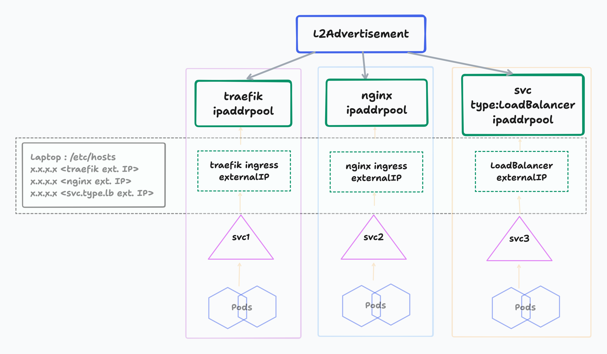

#### Situation

To configure two services in different namespaces within the same k3d cluster to use Traefik as an Ingress controller, while ensuring they have different external IPs.

## Overview

Traefik typically uses a LoadBalancer service type, which may assign the same external IP to multiple services if they share the same Ingress class and configuration. To achieve distinct external IPs for different services, you can utilize MetalLB in conjunction with Traefik to manage multiple external IPs.

## Setting required when using with K3D

When testing other LB-Controllers like MetalLB or Envoy Gateway, the built-in Klipper LoadBalancer in K3s needs to be disabled - to avoid port conflicts in lightweight testing environments. You can pass the appropriate argument while creating the cluster.

```
k3d cluster create my-cluster --k3s-arg '--disable=servicelb@server:0'
```
Once the cluster is up, check that Klipper LoadBalancer is disabled:

`kubectl get pods -n kube-system`

You should not see any pods like:

`svclb-...`

#### You can also permanently disable serviceLB using cluster-config like :
```
apiVersion: k3d.io/v1alpha5
kind: Simple
metadata:
  name: my-cluster
options:
  k3s:
    extraArgs:
      - arg: "--disable=servicelb"
        nodeFilters:
          - server:*
```

#### [Optional] If you would like to disable other K3d components like metrics-server, traefik-ingress:
```
k3d cluster create my-cluster \
--k3s-arg '--disable=servicelb@server:0' \
--k3s-arg '--disable=metrics-server@server:0' \
--k3s-arg '--disable=traefik@server:0
```

## Install using k8s manifest

```
kubectl apply -f https://raw.githubusercontent.com/metallb/metallb/v0.14.9/config/manifests/metallb-native.yaml
```
- Check the name of the docker network assigned to your k3d cluster using :  
```
docker network ls
```
- Inspect your docker network to find out the Subnet/CIDR :  
```
docker network inspect k3d-ingress-test --format='{{json .IPAM.Config}}'
```
- Enter the details and Check the range of usable IP-addresses :  
https://visualsubnetcalc.com

- Exclude the nodes "InternalIP" from this and define the Pool :  
```
spec:
  addresses:
  - 172.18.0.120-172.18.0.130
```
- Then apply the manifests:
```
k apply -f svc.yaml          ## This has the svc+deployment definition
k apply -f first-pool.yaml
k apply -f l2adv.yaml 

```
- Check if your service (currently set to type=LoadBalancer) gets an IP and test with curl:
```
curl 172.18.0.121
welcome to my web app!
```
- Now that IP based service connectivity works, Lets add ingress for DNS name based,  
Edit the `svc.yaml` and remove the `type: LoadBalancer` spec. This will convert the  
active service to `type: ClusterIP` which can be confimed.

- Apply the ingress manifest by setting `ingress.class: "traefik"` since k3d by  
default uses traefik.

- Check if your Ingress resource is created and its got the IP from the right subnet.
- Add the hostname `host: web-app-1.home-k8s.lab` to your laptops `/etc/hosts` file:
```
echo "172.18.0.120 web-app-1.home-k8s.lab" >> /etc/hosts
```
- Now check curl can pull using the hostname :  
```
curl web-app-1.home-k8s.lab
welcome to my web app!
```

#### NOTES:
- One ipaddrpool resource can be shared by multiple sub resource-types like ingress, service(type: Loadbalancers)  
- If there are mutliple CluterIP based services handled by ingress (that uses the externalIP provided by metal-LB) then, this type of service will not be allocated unique externalIP from the ipaddrpool range.  
- For better management of ingress-controller/services, An L2advertisement can be allowed to handle multiple  ipaddrpool's with its own dedicated range.  
  ###### See below
- On laptop, the A records are maintained in the `/etc/hosts` file. In case where a single ingress-controller type is used, only 1 externalIP is allocated to all the per-service ingress created (irrespective of their namespaces)  

  Hence this externalIP takes care of the internal name resolution (be it TLS or non-TLS i.e whether the ingress uses certificates or not it will still be resolved correctly).

---
  
## Install using HELM

```
helm repo add metallb https://metallb.github.io/metallb
helm pull --untar ingress-nginx/ingress-nginx --destination ./helm/
```
If required - Modify the `values.yaml` as desired and then  
```
helm install metallb metallb/metallb \
--values values.yaml \
--namespace metallb \
--create-namespace
```

## FRR mode testing

Create a k3d cluster using :
```
k3d cluster create metal-frr \
--agents 3 \
--k3s-arg "--disable=traefik@server:*" \
--k3s-arg "--disable=servicelb@server:*"
```

Edit `values.yaml` and Install via helm :
```
frrk8s:
  enabled: true
```
Install with these values 
```
helm install metallb . --values values.yaml -n metallb-system --create-namespace
```
Apply the relevant BGP manifests :
```
k apply -f bgp-bfdprofile.yaml
k apply -f bgp-peer.yaml
k apply -f bgp-pool.yaml
k apply -f bgp-adv.yaml
k apply -f bgp-frr-config.yaml
```

Then deploy a [sample_app](./manifests/sample_app/app.yaml)  
`k apply -f app.yaml`

and port-forward this apps LoadBalancer Service (NOTE: This service will be using an externalIP from the bgp-pool range) to your localhost port 80:8000 and access using http://localhost:8000. 

One can then go ahead and try putting this service behind HTTPRoute using EnvoyGateway alongwith the [httpbin service](../envoy-gateway/sample_apps/httpbin/httpbin.yaml).