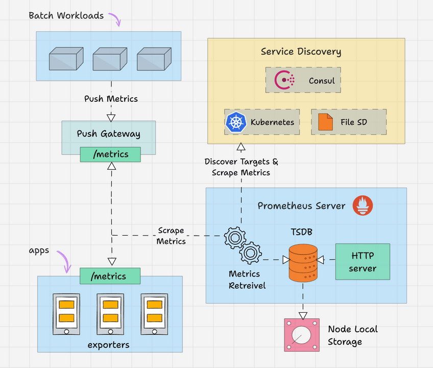
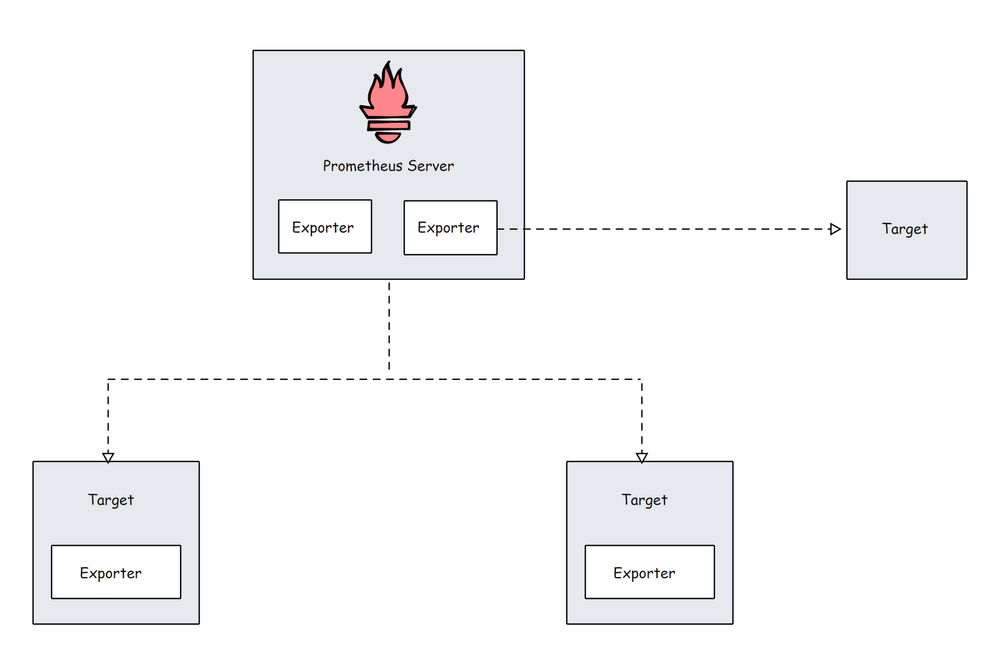
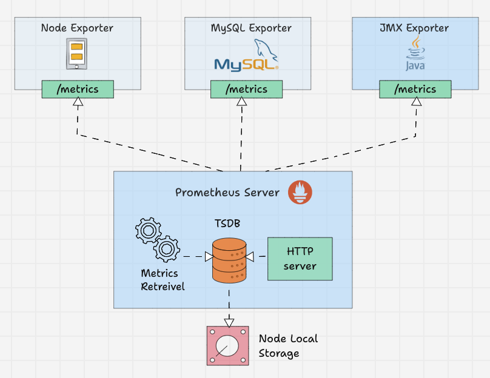
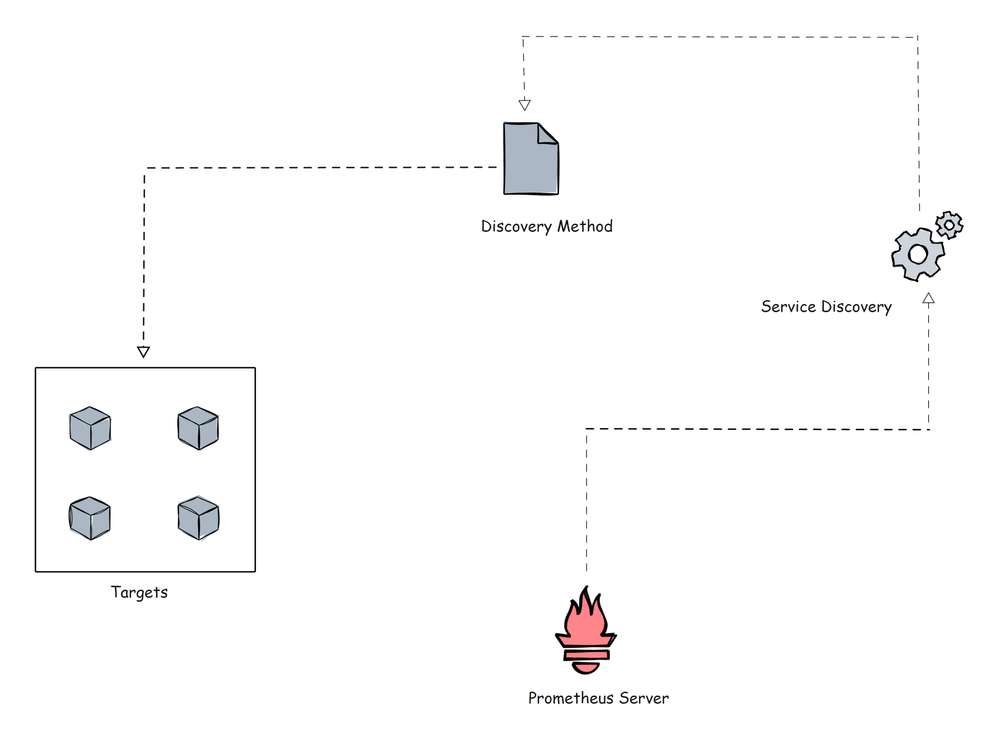
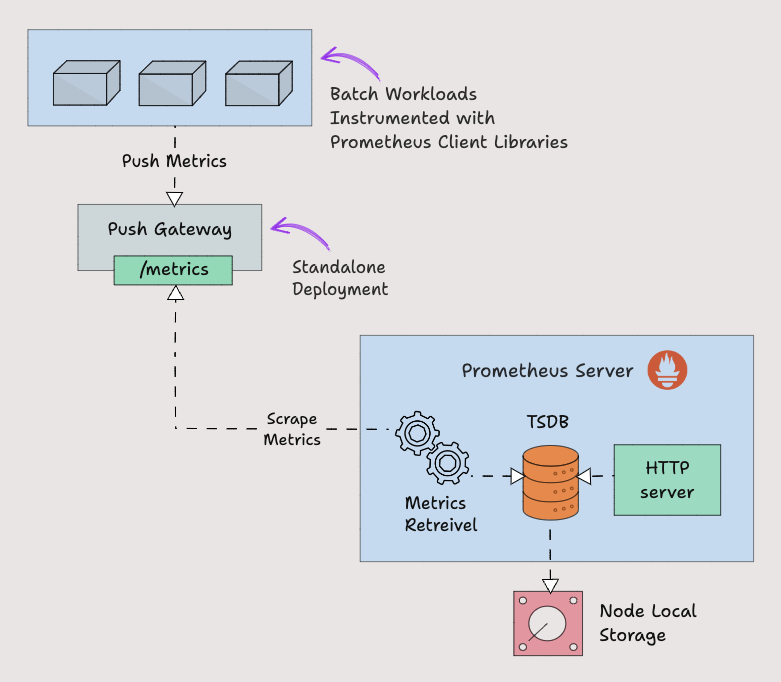
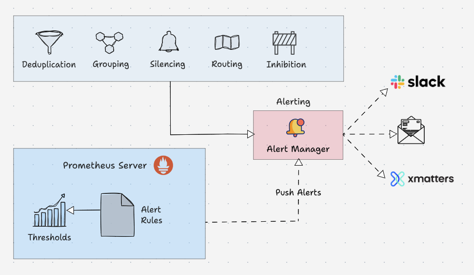
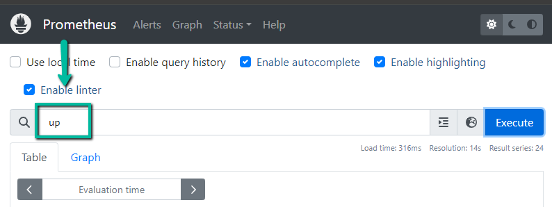
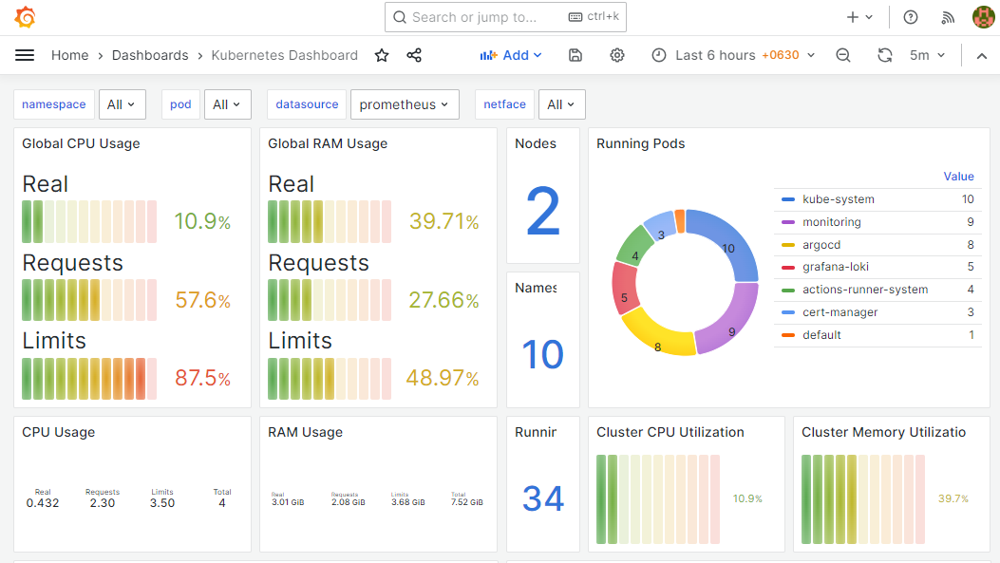

# Prometheus Architecture

In this guide, we will look at Prometheus architecture in detail to understand, configure, and leverage Prometheus architecture effectively.

Prometheus is a popular open-source monitoring and alerting system written in Golang, capable of collecting and processing metrics from various targets. You can also query, view, analyse the metrics and get alerted based on the thresholds.

Also, in today's world, observability is becoming paramount for every organisation, and Prometheus is one of the key observability tools in the open source space.

## What is Prometheus Architecture?

Here is the high level overview of Prometheus architecture.


Prometheus primarily consists of the following.

1. Prometheus Server
2. Service Discovery
3. Time-Series Database (TSDB)
4. Targets
5. Exporters
6. Push Gateway
7. Alert Manager
8. Client Libraries
9. PromQL

Lets look at each component in detail.

## Prometheus Server

The Prometheus server is the brain of the metric-based monitoring system. The main job of the server is to collect the metrics from various targets using pull model.  

Target is nothing but a server, pod, endpoints etc which we will look in to detail in the next topic.  

The general term for collecting metrics from the targets using Prometheus is called scraping.  



Prometheus periodically scrapes the metrics, based on the scrape interval that we mention in the Prometheus configuration file.  

Here is an example configuration.  

```
global:
  scrape_interval: 15s 
  evaluation_interval: 15s 
  scrape_timeout: 10s 

rule_files:
  - "rules/*.rules"

scrape_configs:
  - job_name: 'prometheus'
    static_configs:
      - targets: ['localhost:9090'] 
  - job_name: 'node-exporter'
    static_configs:
      - targets: ['node-exporter:9100'] 

alerting:
  alertmanagers:
    - static_configs:
        - targets: ['alertmanager:9093']
```

## Time-Series Database (TSDB)

The metric data which prometheus receives changes over time (CPU, memory, network IO etc..). It is called time-series data. So Prometheus uses a Time Series Database (TSDB) to store all its data.

By default Prometheus stores all its data in an efficient format (chunks) in the local disk. Overtime, it compacts all the old data to save space. It also has retention policy to get rid of old data.

The TSDB has inbuilt mechanisms to manage data kept for long time. You can choose any of the following data retention policies.

1. **Time based retention**: Data will be kept for the specified days. The default retention is 15 days.
2. **Size-based retention**: You can specify the maximum data TSDB can hold. Once this limit it reached, prometheus will free up the space to accommodate new data.

Prometheus also offers remote storage options. This is primarily required for storage scalability, long-term storage, backup & disaster recovery etc.

## Prometheus Targets

Target is the source where Prometheus scrape the metrics. A target could be servers, services, Kubernetes pods, application endpoints, etc.  



By default prometheus looks for metrics under /metrics path of the target. The default path can be changed in the target configuration. This means, if you dont specify a custom metric path, Prometheus looks for the metrics under /metrics.

Target configurations are present under the scrape_configs in the Prometheus configuration file. Here is an example configuration.

```scrape_configs:
  
  - job_name: 'node-exporter'
    static_configs:
      - targets: ['node-exporter1:9100', 'node-exporter2:9100']
 
  - job_name: 'my_custom_job'
    static_configs:
      - targets: ['my_service_address:port']
    metrics_path: '/custom_metrics'

  - job_name: 'blackbox-exporter'
    static_configs:
      - targets: ['blackbox-exporter1:9115', 'blackbox-exporter2:9115']
    metrics_path: /probe

  - job_name: 'snmp-exporter'
    static_configs:
      - targets: ['snmp-exporter1:9116', 'snmp-exporter2:9116']
    metrics_path: /snmp
```

From the target endpoints, prometheus expects data in certain text format.  
Each metric has to be on a new line.

Usually these metrics are exposed on target nodes using prometheus exporters running on the targets.
Prometheus Exporters

Exporters are like agents that run on the targets. It converts metrics from specific system to format that prometheus understands.

It could be system metrics like CPU, memory etc, or Java JMX metrics, MySQL metrics etc.



By default these converted metrics are exposed by the exporter on `/metrics` path(HTTPS endpoint) of the target.

For example, if you want to monitor a servers CPU and memory, you need to install a node exporter on that server and the node exporter exposes the CPU and memory metrics in the prometheus metrics format on `/metrics`.

Once the Prometheus pulls the metrics, it will then combine the **metric name**, **labels**, **value**, and **timestamp** to give a structure to that data.

There are a lot of community Exporters available, but only some of them are officially approved by Prometheus. In cases where you need more customizations, you need to create your own exporters.

Prometheus categorized the Exporters in various sections such as Databases, Hardware, Issue trackers and continuous integration, Messaging systems, Storage, Software exposing Prometheus metrics, Other third-party utilities, etc.

You can see the list of Exporters from each category from the [official documentation](https://prometheus.io/docs/instrumenting/exporters/?ref=devopscube.com).

In the Prometheus configuration file, all the exporters' details will be given under the `scrape_configs`.

```
scrape_configs:
  - job_name: 'node-exporter'
    static_configs:
      - targets: ['node-exporter1:9100', 'node-exporter2:9100']

  - job_name: 'blackbox-exporter'
    static_configs:
      - targets: ['blackbox-exporter1:9115', 'blackbox-exporter2:9115']
    metrics_path: /probe

  - job_name: 'snmp-exporter'
    static_configs:
      - targets: ['snmp-exporter1:9116', 'snmp-exporter2:9116']
    metrics_path: /snmp
```

## Prometheus Service Discovery

Prometheus uses two methods to scrape metrics from the targets.

1. **Static configs**: When the targets have a static IP or DNS endpoint, we can use those endpoints as targets.
2. **Sevice Discovery**: In most autoscaling systems and distributed systems like Kubernetes, the target will not have a static endpoint. In this case, that target endpoints are discovered using prometheus service discovery and targets are added automatically to the prometheus configuration.



Before going further, let me show a small example of the Kubernetes service discovery block of the Prometheus configuration file using `kubernetes_sd_configs`.

```
  scrape_configs:
      - job_name: 'kubernetes-apiservers'
        kubernetes_sd_configs:
        - role: endpoints
        scheme: https
        tls_config:
          ca_file: /var/run/secrets/kubernetes.io/serviceaccount/ca.crt
        bearer_token_file: /var/run/secrets/kubernetes.io/serviceaccount/token
        relabel_configs:
        - source_labels: [__meta_kubernetes_namespace, __meta_kubernetes_service_name, __meta_kubernetes_endpoint_port_name]
          action: keep
          regex: default;kubernetes;https
```

Kubernetes is the perfect example for dynamic targets. Here, you cannot use the static targets method, because targets (pods) in a Kubernetes cluster is ephemeral in nature and could be short lived.

There is also File-Based Service Discovery `file_sd_configs` in Kubernetes. It is for static targets, but the main difference between the classic Static configuration `static_configs` and the `file_sd_configs` is that, in this, we create separate JSON or YAML files and keep our target information in them. Prometheus will read the files to identify the targets.

Not only these two, but various service discovery methods are available such as consul_sd_configs (where prometheus get target details from [consul](https://devopscube.com/service-discovery-example/)), ec2_sd_configs, etc.

To know more about the configuration details, please visit the [official documentation](https://prometheus.io/docs/prometheus/1.8/configuration/configuration/?ref=devopscube.com).

## Prometheus Pushgateway

Prometheus by default uses pull mechanism to scrap the metrics.

However, there are scenarios where metrics need to be pushed to prometheus.

Lets take an example of a **batch job** running on a Kubernetes cronjob that runs daily for 5 mins based on certain events. In this scenario, Prometheus will not be able to scrape the **service level metrics** properly using pull mechanism.

So instead for waiting for prometheus to pull the metrics, we need to push the metrics to prometheus. To push metrics, prometheus offers a solution called Pushgateway. It is kind of a intermediate gateway.

Pushgateway needs to be run as a standalone component. The batch jobs can push the metrics to the pushgateway using HTTP API. Then Pushgateway exposes those metrics on /metrics endpoint. Then prometheus scrapes those metrics from the Pushgateway.



Pushgateway stores the metrics data temporarily in in-memory storage. It's more of a temporary cache.

Pushgateway configuration also will be configured under the `scrape_configs` section in the Prometheus configuration.
```
scrape_configs:
  - job_name: "pushgateway"
        honor_labels: true
        static_configs:
        - targets: [pushgateway.monitoring.svc:9091]
```
To send metrics to the Pushgateways, you need to use the prometheus Client Libraries and instrument the application or script to expose the required metrics.

## Prometheus Client Libraries

Prometheus Client Libraries are software libraries that can be used to instrument application code to expose metrics in the way Prometheus understands.

In cases where you need custom instrumentation or you want to create your own exporters, you can use the client libraries.

A very good use case is batch jobs that need to push metrics to the Pushgateway. The batch job needs to be instrumented with client libraries to expose requirement metrics in prometheus format.

Here is an example Python Client Library that exposes custom metrics named `batch_job_records_processed_total`.
```
from prometheus_client import start_http_server, Counter
import time
import random

RECORDS_PROCESSED = Counter('batch_job_records_processed_total', 'Total number of records processed by the batch job')

def process_record():
    time.sleep(random.uniform(0.01, 0.1))
    RECORDS_PROCESSED.inc()

def batch_job():
   
    for _ in range(100):
        process_record()

if __name__ == '__main__':
 
    start_http_server(8000)
    print("Metrics server started on port 8000")

    batch_job()
    print("Batch job completed")

    while True:
        time.sleep(1)
```
Also when using client libraries, `prometheus_client` HTTP server exposes the metrics in /metrics endpoint.

Prometheus has Client Libraries for almost every programming language, and also if you want to create a Client Library, you can do it.

To learn more about the guidelines of the creation and view the list of Client Libraries, you can refer to the official documentation.

## Prometheus Alert Manager

[Alertmanager](https://devopscube.com/prometheus-alert-manager) is the key part of Prometheus monitoring system. Its primary job is to send alerts based on metric thresholds set in the Prometheus alert configuration.

The alert get triggered by Prometheus and sent to Alertmanager. It in turn sends the alerts to the respective notification systems/receivers (email, slack etc) configured in the alert manager configurations.

Also, alert manager takes care of the following.

1. **Alert Deduplicating**: Process of silencing duplicated alerts.
2. **Grouping**: Process of grouping related alerts togther.
3. **Silencing**: Silence alerts for maintenance or false positives.
4. **Routing**: Routing alerts to appropriate receivers based on severities.
5. **Inhibition**: Process of stopping low severity alert when there is a medium of high severity alert.



Here is an example configuration of an alert rule.
```
groups:
- name: microservices_alerts
  rules:
  - record: http_latency:average_latency_seconds
    expr: sum(http_request_duration_seconds_sum) / sum(http_request_duration_seconds_count)
  - alert: HighLatencyAlert
    expr: http_latency:average_latency_seconds > 0.5
    for: 5m
    labels:
      severity: critical
    annotations:
      summary: "High latency detected in microservices"
      description: "The average HTTP latency is high ({{ $value }} seconds) in the microservices cluster."
```
This is an example of the routing configuration of the Alertmanager configuration file
```
routes:
- match:
    severity: 'critical'
  receiver: 'pagerduty-notifications'

- match:
    severity: 'warning'
  receiver: 'slack-notifications'
```
Alert managers supports most of the message and notification systems such as Discord, Email, Slack, etc to reach the alert as a notification to the receiver.
## PromQL

PromQL is a flexible query language that can be used to query time series metrics from the prometheus.

We can directly used the queries from the Prometheus user interface or we can use curl command to make a query over the command line interface.

### Prometheus UI



Query over the CLI

`curl "http://54.186.154.78:30000/api/v1/query?query=$(echo 'up' | jq -s -R -r @uri)" | jq .`

Also, when you add prometheus as a data source to Grafana, you can use PromQL to query and create Grafana dashboards as shown below.



Also, it will help you prepare for the [Prometheus certification](https://devopscube.com/prometheus-certified-associate) as well

As a next step, you can try setting up [prometheus on Kubernetes](https://devopscube.com/setup-prometheus-monitoring-on-kubernetes).

# Install Locally on Laptop using docker
```
docker run -it -p 9090:9090 prom/prometheus

docker run -it -p 3000:3000 grafana/grafana
```

## Using HELM

- Add prometheus repo:  
```
helm repo add prometheus-community https://prometheus-community.github.io/helm-charts

helm repo update
```

## Note 

By default this chart installs additional, dependent charts:

- prometheus-community/kube-state-metrics
- prometheus-community/prometheus-node-exporter
- grafana/grafana

## Install

```
helm install prometheus kube-prometheus-stack/ -f kube-prometheus-stack/values.yaml -n prometheus --create-namespace
NAME: prometheus
LAST DEPLOYED: Mon Feb  3 23:04:55 2025
NAMESPACE: prometheus
STATUS: deployed
REVISION: 1
NOTES:
kube-prometheus-stack has been installed. Check its status by running:
  kubectl --namespace prometheus get pods -l "release=prometheus"

Visit https://github.com/prometheus-operator/kube-prometheus for instructions on how to create & configure Alertmanager and Prometheus instances using the Operator.
```

### To use a specific Grafana version  

Check the **APPLICATION VERSION** and helm **CHART VERSION** from [Artifacthub](https://artifacthub.io/packages/helm/grafana/grafana)  


Modify `observability/prometheus/kube-prometheus-stack/charts/grafana/values.yaml` :  
- `appVersion: 11.4.0`  
- `version: 8.8.5`  

Also under `observability/prometheus/kube-prometheus-stack/Chart.yaml`:  

```
### Modify
...
- condition: grafana.enabled
  name: grafana
  repository: https://grafana.github.io/helm-charts
  version: 8.8.*
...
```

#### Before upgrading, Perform a dry-run using  
```
helm upgrade prometheus . -f values.yaml --dry-run > test-upgrade.txt

bat test-upgrade.txt
```

## Reference

- [Kube-Prometheus-Stack](https://github.com/prometheus-community/helm-charts/tree/main/charts/kube-prometheus-stack)
- [Kodekloud Prometheus](https://www.youtube.com/watch?v=6xmWr7p5TE0)